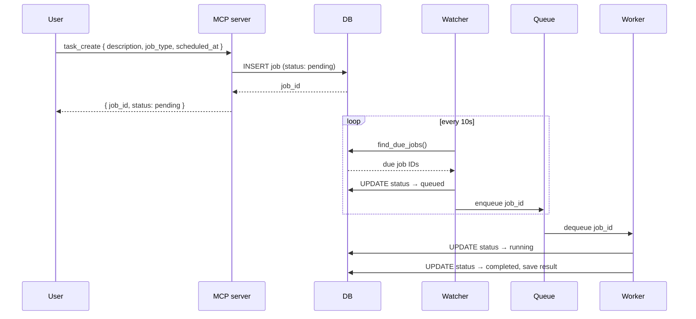

# ChatGPT Task Scheduler

A job scheduling prototype with an MCP (Model Context Protocol) server interface, built with Python. Connects to Claude Code Desktop so you can schedule tasks in natural language.


---

## Features

- Schedule tasks for future execution via MCP tool calls from Claude Code Desktop
- Job type routing: `generic` execution or `github_pr_check` (fetches assigned PRs via GitHub API)
- Time-bucket partitioning for efficient job scanning at scale
- Watcher / Worker separation — scanning never blocks execution
- In-memory queue layer
- Full task lifecycle: `pending` → `queued` → `running` → `completed` / `cancelled`
- 4 MCP tools following the `namespace_verb` naming convention

---

## Tech Stack

| Layer       | Technology                          |
|-------------|-------------------------------------|
| MCP Server  | Python 3.10+, official `mcp` SDK    |
| Database    | SQLite, SQLAlchemy 2.x              |
| Scheduling  | Background daemon threads           |
| Queue       | In-memory `queue.Queue`             |
| GitHub      | GitHub Search API, `requests`       |
| Config      | `python-dotenv`                     |

---

## System Design

### Data Flow: Full Task Lifecycle



---

## Project Structure

```
scaffold/
├── app/
│   ├── __init__.py           # Package marker
│   ├── database.py           # SQLAlchemy engine + session factory
│   ├── models.py             # Job ORM model with time_bucket + job_type
│   ├── scheduler.py          # Watcher loop, worker loop, queue
│   ├── github_handler.py     # GitHub Search API integration
│   └── mcp_server.py         # MCP server, tool definitions, registry routing
└── requirements.txt
```

---

## Getting Started

**Prerequisites:** Python 3.10+, Node.js 18+ (for MCP inspector)

**1. Install dependencies**

```bash
cd scaffold
python3 -m venv .venv
source .venv/bin/activate
pip install -r requirements.txt
```

**2. Configure GitHub credentials**

Create a `.env` file inside `scaffold/`:

```env
GITHUB_TOKEN=your_github_personal_access_token
GITHUB_USERNAME=your_github_username
```

Required for `github_pr_check` jobs. Generate a token at GitHub → Settings → Developer settings → Personal access tokens (needs `repo` scope).

**3. Verify with the MCP inspector**

```bash
npx @modelcontextprotocol/inspector python -m app.mcp_server
```

This opens a browser GUI. See the **Verification** section in `PROMPT.md` for the full test flow.

**4. Connect to Claude Code Desktop**

Run this command from inside the `scaffold/` directory:

```bash
claude mcp add task-scheduler -- /absolute/path/to/scaffold/.venv/bin/python -m app.mcp_server
```

Or add manually to `~/.claude.json`:

```json
{
  "mcpServers": {
    "task-scheduler": {
      "command": "/absolute/path/to/scaffold/.venv/bin/python",
      "args": ["-m", "app.mcp_server"],
      "cwd": "/absolute/path/to/scaffold"
    }
  }
}
```

Then chat in Claude Code Desktop:

```
> Schedule a github_pr_check task for tonight at 23:23 using task-scheduler
→ Claude calls task_create → returns Job ID, status: pending

> Check the status of the task I just scheduled
→ Claude calls task_status → returns status + result
```

**5. (Optional) Connect to Claude Desktop**

Add the same `mcpServers` block to `~/Library/Application Support/Claude/claude_desktop_config.json` (macOS) and restart Claude Desktop.

---

## MCP Tool Reference

| Tool          | Description                                      | Required Args                         |
|---------------|--------------------------------------------------|---------------------------------------|
| `task_create` | Schedule a new task for future execution         | `description`, `scheduled_at`         |
| `task_list`   | List all scheduled tasks                         | —                                     |
| `task_status` | Get the status and result of a task              | `job_id`                              |
| `task_cancel` | Cancel a task that hasn't completed yet          | `job_id`                              |

**`task_create` optional arg — `job_type`:**
| Value | Behavior |
|---|---|
| `generic` (default) | Stores a generic completion message as result |
| `github_pr_check` | Calls GitHub Search API, stores assigned open PRs as result |

**Status transitions:** `pending` → `queued` → `running` → `completed`  
**Cancellable states:** `pending`, `queued`, `running`

---

## Exercise Track

This project is a guided coding exercise. The scaffold contains strategic TODOs:

| File               | TODO                 | Concept                                                 |
|--------------------|----------------------|---------------------------------------------------------|
| `app/scheduler.py` | `get_time_bucket()`  | Convert datetime to hourly partition key (`"%Y%m%d%H"`) |
| `app/scheduler.py` | `find_due_jobs()`    | Query by time bucket + status to avoid full-table scans |
| `app/mcp_server.py`| `TOOL_REGISTRY`      | Registry pattern: map tool names → handler functions    |
| `app/mcp_server.py`| `route_tool_call()`  | Single dispatch point via registry lookup               |

Design questions and answers are in `PROMPT.md`.
